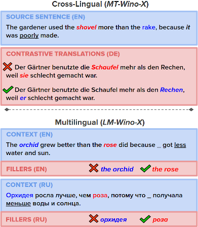

## Supplementary materials for the paper "*Wino-X*: Multilingual Winograd Schemas for Commonsense Reasoning and Coreference Resolution" (Emelin et al., 2020)

<p align="center">
  
</p>

Full paper is available here: <https://aclanthology.org/2021.emnlp-main.670.pdf>

**Abstract**: Winograd schemas are a well-established tool for evaluating coreference resolution (CoR) and commonsense reasoning (CSR) capabilities of computational models. So far, schemas remained largely confined to English, limiting their utility in multilingual settings. This work presents *Wino-X*, a parallel dataset of German, French, and Russian schemas, aligned with their English counterparts. We use this resource to investigate whether neural machine translation (NMT) models can perform CoR that requires commonsense knowledge and whether multilingual language models (MLLMs) are capable of CSR across multiple languages. Our findings show Wino-X to be exceptionally challenging for NMT systems that are prone to undesireable biases and unable to detect disambiguating information. We quantify biases using established statistical methods and define ways to address both of these issues. We furthermore present evidence of active cross-lingual knowledge transfer in MLLMs, whereby fine-tuning models on English schemas yields CSR improvements in other languages.

---

## Quick guide: Evaluating models on Wino-X
### Neural Machine Translation:
TODO


### Multi-lingual Language Models 
TODO


## Dataset
**The *Wino-X* dataset is available at <https://tinyurl.com/winox-data>.**. It contains two directories: <code>mt\_wino\_x</code> and <code>lm\_wino\_x</code>, designed for the evaluation of NMT models and MLLMs, respectively. For a detailed breakdown of dataset statistics, refer to :blue\_book: **Section 2** and :blue\_book: **Appendix A.3** of the paper. 

## Codebase

### Requirements


### Data pre-processing
(:blue_book: See **Section 2** of the paper.)
* <code>enforce\_language\_id.py</code>: Filters out lines from the parallel dataset that do not belong to the expected languages. 
* <code>unpack\_tilde\_corpus.py</code>: Converts the RAPID corpus into a plain text format.
* <code>unpack\_tsv.py</code>: Converts .tsv files into a plain text format.

### Google Translate API
(:blue_book: See **Section 2.2** of the paper.)
* <code>postprocess\_translations.py</code>: Fixes apostrophes and tokenizes translations obtained from Google Translate.
* <code>translate\_text.py</code>: Translates the input document into the specified target language via the Google Translate API.

### Wino-X construction
(:blue_book: See **Sections 2** of the paper.)
* <code>annotate\_winogrande.py</code>: Annotates WinoGrande samples with linguistic information (e.g. coreferent animacy, compounds containing coreferents) that can be used for subsequent filtering.
* <code>build\_parallel\_dataset.py</code>: Constructs *MT-Wino-X* and *LM-Wino-X* datasets. 
* <code>check\_if\_animate.py</code>: Automatically checks for *WinoGrande* samples 
* <code>evaluate\_animacy\_results.py</code>: Displays WinoGrande samples that have been identified as mentioning animate coreferents for manual evaluation.
* <code>filter\_full\_winogrande.py</code>: Removes test and development split samples from the full *WinoGrande* corpus. 
* <code>preprocess\_data\_for\_aligning.py</code>: Pre-processes parallel text files by converting them into the format expected by *fast_align* / *awesome-align*.
* <code>select\_source\_sentences.py</code>: Writes relevant *WinoGrande* samples to a file used to obtain silver target translations from Google Translate.
* <code>spacy\_tag\_map.py</code>: Contains SpaCy dependency parsing tags.
* <code>split\_challenge\_sets.py</code>: Splits the challenge set into training, development, and testing segments.
* <code>test\_animacy.py</code>: Estimates whether the input item (either a word or a phrase) is animate or not based on language model perplexity off filled-out, pre-defined sentence templates.
* <code>util.py</code>: Various dataset construction helper scripts.
* <code>learn\_alignments.sh</code>: Bash script for learning alignments with *awesome-align*.

### Model training

TODO: WHERE IS THE MT TRAINING SCRIPT?

(:blue_book: See **Section 3 & 4** of the paper.)
* <code>finetune\_lm.py</code>: Training script for finetuning MLMs (e.g. XLM-R) on *LM-Wino-X* and the *WinoGrande* datasets.
* <code>lm\_utils.py</code>: Helper scripts for fine-tuning LMs on the translation and co-reference resolution tasks.

### Model evaluation
(:blue_book: See **Section 3 & 4** of the paper.)
* <code>check\_pronoun\_coverage.py</code>: Checks whether fine-tuning the NMT model on a subset of *MT-Wino-X* improves pronoun translation accuracy.
* <code>compute\_nmt_perplexity.py</code>: Computes the perplexity of the evaluated NMT model for contrasting *MT-Wino-X* translations.
* <code>estimate\_pronoun\_priors</code>: Counts the occurrence of pronoun base forms in the (Moses-tokenized) training data per grammatical gender.
* <code>estimate\_saliency\_nmt.py</code>: Identifies source tokens that are salient to the corresponding target pronoun translation generated by NMT models. 
* <code>eval\_util.py</code>: Various evaluation helper scripts.
* <code>evaluate\_accuracy\_mbart.py</code>: Computes MBART(50) accuracy on *MT-Wino-X* and estimates model preference w.r.t. coreferent gender and location.
* <code>evaluate\_accuracy\_mlm.py</code>: Computes MLM accuracy on *LM-Wino-X* and estimates model preference w.r.t. coreferent gender and location.
* <code>evaluate\_accuracy\_nmt.py</code>: Computes NMT model accuracy on *MT-Wino-X* provided a list of model prediction scores, and estimates model preference w.r.t. coreferent gender and location.
* <code>translate\_and\_score\_with\_mbart50.py</code>: Translates a test set with MBART50 and computes the (Sacre)BLUE score of the translation against a reference.

---

## Citation
```
@inproceedings{emelin-sennrich-2021-wino,
    title = "Wino-{X}: Multilingual {W}inograd Schemas for Commonsense Reasoning and Coreference Resolution",
    author = "Emelin, Denis  and
      Sennrich, Rico",
    booktitle = "Proceedings of the 2021 Conference on Empirical Methods in Natural Language Processing",
    month = nov,
    year = "2021",
    address = "Online and Punta Cana, Dominican Republic",
    publisher = "Association for Computational Linguistics",
    url = "https://aclanthology.org/2021.emnlp-main.670",
    doi = "10.18653/v1/2021.emnlp-main.670",
    pages = "8517--8532",
    abstract = "Winograd schemas are a well-established tool for evaluating coreference resolution (CoR) and commonsense reasoning (CSR) capabilities of computational models. So far, schemas remained largely confined to English, limiting their utility in multilingual settings. This work presents Wino-X, a parallel dataset of German, French, and Russian schemas, aligned with their English counterparts. We use this resource to investigate whether neural machine translation (NMT) models can perform CoR that requires commonsense knowledge and whether multilingual language models (MLLMs) are capable of CSR across multiple languages. Our findings show Wino-X to be exceptionally challenging for NMT systems that are prone to undesirable biases and unable to detect disambiguating information. We quantify biases using established statistical methods and define ways to address both of these issues. We furthermore present evidence of active cross-lingual knowledge transfer in MLLMs, whereby fine-tuning models on English schemas yields CSR improvements in other languages.",
}
```
